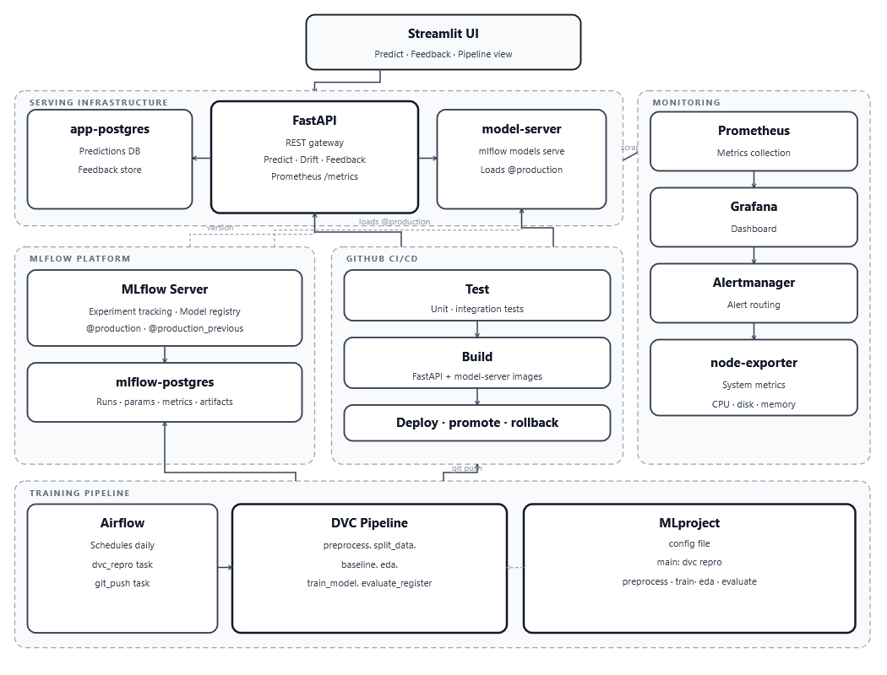

# Architecture Document

## 1. Architecture Diagram



---

## 2. Component Descriptions

| Zone | Component | Role |
|------|-----------|------|
| Serving Infrastructure | Streamlit UI | Web interface — upload spectra, view predictions, submit feedback , View Pipeline |
| Serving Infrastructure | FastAPI | REST gateway — preprocessing, drift detection, feedback, metrics |
| Serving Infrastructure | model-server | `mlflow models serve` — loads `@production` model for inference |
| Serving Infrastructure | app-postgres | Stores all predictions, confidence scores, feedback |
| Monitoring | Prometheus | Scrapes FastAPI `/metrics` (port 8000) and Streamlit `/metrics` (port 8002) every 15 seconds |
| Monitoring | Grafana | Near real-time dashboard — visualises all metrics scrapped|
| Monitoring | Alertmanager | Routes fired alerts to email and grafana dashboard |
| Monitoring | node-exporter | Collects system metrics (CPU, disk, memory) |
| MLflow Platform | MLflow Server | Tracks experiments, model registry with aliases |
| MLflow Platform | mlflow-postgres | Backend store for runs, metrics, params, artifacts |
| GitHub CI/CD | Test | Unit + integration tests on every push |
| GitHub CI/CD | Build | Builds FastAPI and model-server Docker images |
| GitHub CI/CD | Deploy | Deploys containers, promotes model or rolls back |
| Training Pipeline | Airflow | Schedules daily `dvc repro` and `git commit` if new model registerd |
| Training Pipeline | DVC Pipeline | 6-stage reproducible ML pipeline with smart caching |
| Training Pipeline | MLproject | Config file defining entry points and Python environment |

---

## 3. Network Topology

| Network | Connected Services | Purpose |
|---------|-------------------|---------|
| `mlflow-network` | MLflow Server, mlflow-postgres, model-server, Airflow | MLflow tracking access |
| `api-network` | FastAPI, model-server, app-postgres, Streamlit | Serving communication |
| `monitoring-network` | FastAPI, Prometheus, Grafana, Alertmanager, node-exporter, Streamlit | Metrics collection |
| `airflow-network` | Airflow internal services | Airflow internal only |

---

## 4. MLOps Lifecycle

### 4.1 Data Versioning
Raw spectra and golden test set are tracked with DVC. Git tracks code, pipeline definitions, and DVC pointer files.

```
data/raw/    → DVC tracked (data/raw.dvc in git)
data/golden/ → DVC tracked (data/golden.dvc in git)
dvc.lock     → pipeline state + data hashes (in git)
params.yaml  → pipeline parameters (in git)
```

Data versions tagged in git: `v1-preprocessed` (basic) and `v2-preprocessed` (advanced).

### 4.2 Experiment Tracking
Train pipeline run one model, selected via `params.yaml` (`training.model_name`). The model performs internal hyperparameter search:

- **SVM, RF:** GridSearchCV with predefined parameter ranges
- **MLP, CNN:** Manual random search (15 trials) over search space
- **PLS-DA:** Manual grid over `n_components`
- All tracking is implemented manually (no autolog) — giving full control over what is logged per run.

Each trial is logged as an MLflow **child run** with its parameters and CV score. Best hyperparameters are selected, model retrained on full train+val set, and test metrics logged to the **parent MLflow run**. The `pipeline_run_id` tag links the run to its evalaute_register execution. `APPLY_ADVANCED` is read from the MLflow run tags at FastAPI startup to ensure preprocessing always matches the deployed model.

### 4.3 Model Registry
MLflow aliases used instead of deprecated stages:

| Alias | Meaning |
|-------|---------|
| `@production` | Currently serving |
| `@production_previous` | Rollback point |

New model promoted only if it outperforms current `@production` on the golden test set. `model_registry_log.txt` written on promotion → triggers CI/CD via git push.

### 4.4 Airflow Orchestration
Two-task DAG runs daily:

```
dvc_repro ──▶ git_commit
```

`dvc_repro` runs the full dvc pipeline if dvc recognizes any chnages. `git_commit` commits only if `model_registry_log.txt` or `dvc,lock` changed — i.e. only when a new model was registered.

### 4.5 MLproject
Packages training pipeline as named entry points with a pinned Python environment (`python_env.yaml` → `requirements-train.txt`). Ensures identical environments across development and production.

Entry points: `main` (dvc repro) · `preprocess` · `train` · `eda` · `evaluate`

### 4.6 CI/CD Pipeline
Triggered by `model_registry_log.txt`, `Fastapi` or `Dcoker image` change on `main` branch. Self-hosted runner executes:

```
Test → Build → Deploy → (promote @production on success) or (rollback to @production_previous on fail)
```

### 4.7 Monitoring and Feedback Loop
Prometheus scrapes metrics from FastAPI (`/metrics` port 8000) and session metrics from Streamlit (`/metrics` port 8002). Grafana alerts fire on error rate > 5%, drift > 0.3 and model-server down > 30s. User feedback via `/feedback` endpoint updates prediction records and saves spectra to `data/labeled/` whcih then verified by Domain experts for next retraining cycle.

---

## 5. Data Flows

### Prediction Request
```
Streamlit → POST /predict → FastAPI → preprocess spectrum
→ POST /invocations → model-server → probabilities
→ FastAPI computes confidence + drift → stores in app-postgres
→ returns result → Streamlit displays
```

### Retraining Pipeline
```
Airflow → dvc repro:
→ if new model passes golden test → @production updated
→ git commit → Developer git push → CI/CD → test → build → deploy model-server and FastAPI endpoints
→ model-server loads new @production → /ready = 200
```
